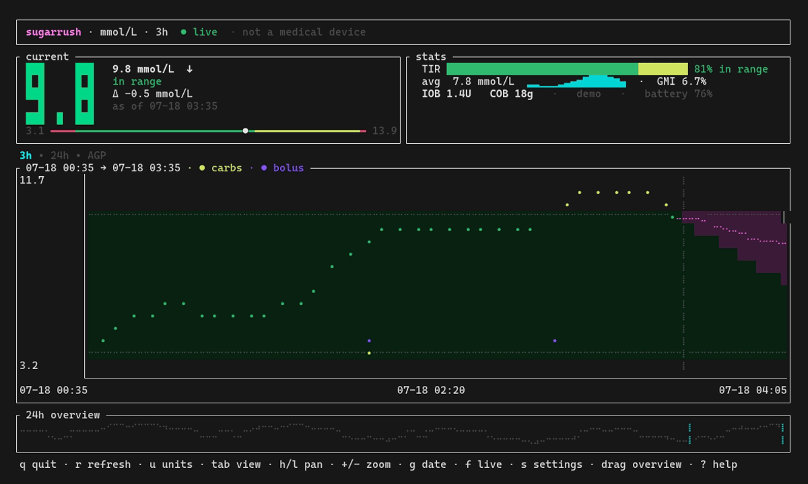

# sugarrush

**Your [Nightscout](https://nightscout.github.io/) CGM data, in the terminal.**
A fast, keyboard-driven TUI for glanceable blood glucose — live value, history,
forecast, alerts, and stats — built with Rust + [Ratatui](https://ratatui.rs/).

[](https://github.com/ronaldlokers/sugarrush/actions/workflows/ci.yml)
[](https://github.com/ronaldlokers/sugarrush/releases/latest)




> ⚠️ **Not a medical device.** Don't use `sugarrush` for treatment decisions —
> always confirm with your meter, pump, or official app.

## Try it in 5 seconds

No Nightscout, no config, no network — just synthetic data:

```bash
sugarrush --demo
```

That's the recording above. When you're ready, point it at your own site
([configure](#configuration)).

## What it does

**At a glance**
- Big, colour-coded current value with trend arrow, delta, and a plain-text
  range label (readable without colour)
- Time-in-range, mean glucose + GMI (estimated A1c), and device status
  (battery, sensor age, last seen)
- Insulin-on-board / carbs-on-board, with carb & bolus markers on the graph

**History & forecast**
- Live braille/dot graph you can **pan** (`h`/`l`), **zoom** (`+`/`-`,
  1h–24h), and **jump to a date** (`g`)
- A 24h **minimap** you click or drag to move the window
- Short-term **forecast** overlay (uploader predictions or a local AR2
  fallback) with a "now" line and a *time-to-low/high* ETA

**Alerts & safety**
- In-TUI banner + cross-platform desktop notifications (Linux/macOS/Windows)
- **Audible alarm** for urgent lows/highs with snooze, per-level tones,
  **quiet hours**, and unacknowledged-alarm **escalation** (incl. phone push)
- Predictive alerts before a threshold is crossed; offline vs. sensor-gap
  distinction so you know *why* data stopped

**Yours to shape**
- In-app **settings screen** (`s`) — edit units, thresholds, alarms, theme,
  and more live, then save back to `config.toml`
- Configurable colours (incl. a colorblind-safe preset), graph style, and
  **multiple sites** (`n` to switch)
- A **Waybar** module for your status bar (see [Waybar](#waybar))

## Install

```bash
# Arch (AUR)
yay -S sugarrush-bin

# Homebrew (macOS/Linux)
brew install ronaldlokers/tap/sugarrush

# crates.io (compiles from source)
cargo install sugarrush

# …or a prebuilt binary via cargo-binstall (no compile)
cargo binstall sugarrush

# …or the shell installer (Linux/macOS) — grabs the right prebuilt binary
curl --proto '=https' --tlsv1.2 -LsSf \
  https://github.com/ronaldlokers/sugarrush/releases/latest/download/sugarrush-installer.sh | sh
```

Prebuilt archives (Linux gnu/musl, macOS x86_64/arm64, Windows) are attached to
every [release](https://github.com/ronaldlokers/sugarrush/releases). From a
checkout: `cargo build --release` (binary at `target/release/sugarrush`).

## Configuration

First run with no config launches an interactive setup wizard. Prefer to do it
by hand? Copy the example:

```bash
mkdir -p ~/.config/sugarrush
cp config.example.toml ~/.config/sugarrush/config.toml
chmod 600 ~/.config/sugarrush/config.toml
```

### Nightscout token (read-only)

Do **not** use `API_SECRET` (admin-level). Create a read-only token in
**Nightscout → Admin Tools**:

1. Add a **Subject** (e.g. `sugarrush`).
2. Give it the `readable` role.
3. Copy its access token into `config.toml` as `token`.

It's sent as a `?token=…` query parameter and only grants read access.

### Token storage & permissions

The token is stored **in plaintext** in `config.toml`. It's read-only (exposes
your glucose data, not account control), but keep the file private —
`chmod 600`. The setup wizard already does this, and sugarrush warns in the
footer if the file is group/world-readable. No `token_cmd`/env indirection by
design: file-only, documented.

## Keybindings

| Key | Action |
|-----|--------|
| `q` / `Esc` | Quit |
| `r` | Refresh now |
| `u` | Toggle mg/dL ↔ mmol/L |
| `h` / `←` · `l` / `→` | Pan back / forward in time |
| `+` / `-` | Zoom window (1h/3h/6h/12h/24h) |
| `g` | Jump to a date (`YYYY-MM-DD`) |
| `f` / `Home` | Return to live |
| `a` | Snooze the audible alarm |
| `n` | Switch site (multi-site) |
| `s` | Open / close settings |

Settings screen: `↑`/`↓` select, `←`/`→` change, `w` save, `s`/`Esc` back.
When the minimap is on, click or drag it to move the window.

## Waybar

`sugarrush waybar` prints one Waybar JSON line (value + arrow + delta, an
hourly sparkline tooltip, and a CSS class per alert state). Example assets in
[`waybar/`](waybar/): the custom module, a Graph/Settings/About menu (Waybar
≥ 0.11.0), per-state CSS, and Hyprland float rules.

Other subcommands: `sugarrush about` (version + a notification) and
`sugarrush --screen settings` (open straight to settings).

## Roadmap

Planned and in-progress work lives in the
[GitHub issues](https://github.com/ronaldlokers/sugarrush/issues) — see the
[product roadmap](https://github.com/ronaldlokers/sugarrush/issues/51).

## License

MIT © Ronald Lokers
