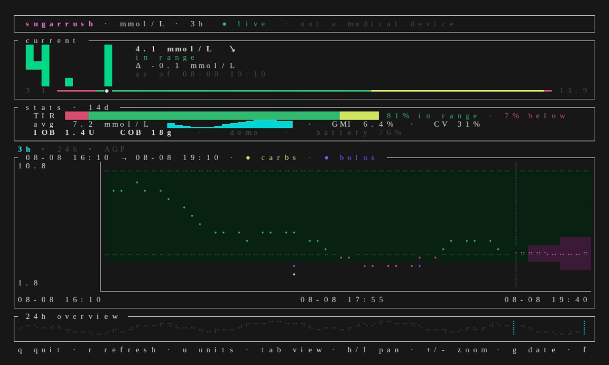

# sugarrush

**Your [Nightscout](https://nightscout.github.io/) CGM data, in the terminal.**
A fast, keyboard-driven TUI for glanceable blood glucose — live value, history,
forecast, alerts, and stats — built with Rust + [Ratatui](https://ratatui.rs/).

[](https://github.com/ronaldlokers/sugarrush/actions/workflows/ci.yml)
[](https://github.com/ronaldlokers/sugarrush/releases/latest)




> ⚠️ **Not a medical device.** Don't use `sugarrush` for treatment decisions —
> always confirm with your meter, pump, or official app.

## Try it in 5 seconds

No Nightscout, no config, no network — just synthetic data:

```bash
sugarrush --demo
```

That's the recording above. When you're ready, point it at your own site
([configure](#configuration)).

## Who this is for

You can use sugarrush for your own readings or to follow someone else's
Nightscout site. Following is a relationship, not just a URL: the person whose
data is shown should know what you can see, why you are watching, and when you
will act on an alert. Agree those expectations together, use a separate
read-only token, and remove that access when it is no longer wanted.

The person wearing the sensor remains the authority on treatment and on who
may see their health data. Sugarrush is an additional display and alarm layer;
it does not replace their official CGM app, agreed care plan, or emergency
arrangements. This matters especially for children and other people who may not
be able to grant or withdraw access on their own: involve them at a level they
can understand and revisit the arrangement as their independence changes.

## What it does

Treatment logging is optional and read-only remains the default. A separate
Nightscout `careportal` token can authorize an explicitly confirmed command;
Sugarrush checks its exact treatment-create permission before each write and
keeps a private audit without token or note contents:

```sh
sugarrush treatment --site Alex --carbs 15 --note "snack"
sugarrush treatment --site Alex --insulin 1.5 --at 2026-08-09T14:30:00+02:00
```

The interactive command shows a summary and requires typing the person's name.
Automation must additionally provide `--non-interactive --confirm` and a stable
`--operation-id UUID`; reuse that UUID after an unknown outcome so Nightscout
can deduplicate the retry. This records what someone reports having taken; it does not recommend a dose,
deliver insulin, or verify that a treatment was clinically correct. Confirm the
accepted entry in Nightscout. Create the write token as a Nightscout Subject
with the `careportal` role, keep the existing `readable` token separate, and
remove the write token in Settings by entering `off` when it is no longer needed.

Inspect or deliberately erase the opt-in private history cache without exposing
its readings:

```sh
sugarrush cache status
sugarrush cache clear --site Alex --confirm
sugarrush cache clear --all --confirm
```

**At a glance**
- Big, colour-coded current value with trend arrow, delta, and a plain-text
  range label (readable without colour)
- Time-in-range across the five clinical bands (very low → very high) with
  time-below-range called out, mean glucose, GMI (estimated A1c), and CV
  (glycaemic variability) over a fixed clinical window (last 14 days by
  default), plus device status (battery, sensor age, last seen)
- Insulin-on-board / carbs-on-board, with carb & bolus markers on the graph

**History & forecast**
- Switchable **graph views** (`Tab`) — a 3h or 24h timeline, or an **AGP**
  (ambulatory glucose profile) folding days of readings into a percentile band
  (median + IQR + 5/95), which also **names the pattern** it finds — e.g.
  `⚠ lows 02:00–05:00 (down to 3.1 mmol/L)`
- Live braille/dot graph you can **pan** (`h`/`l`), **zoom** (`+`/`-`,
  1h–24h), step **day by day** (`[`/`]`), and **jump to a date** (`g`)
- A 24h **minimap** you click or drag to move the window
- Short-term **forecast cone** (uploader predictions or a local AR2 fallback)
  showing the high/low uncertainty band, with a "now" line and a
  *time-to-low/high* ETA

**Alerts & safety**
- A **headless watcher** (`sugarrush watch`) that keeps alarming with no
  terminal open — the 3am case — and hands a single-site alarm to the dashboard
  while it is up
- In-TUI banner + cross-platform desktop notifications (Linux/macOS/Windows),
  switchable to **content-free** so nothing readable lands on a lock screen
- **Audible alarm** for urgent lows/highs with snooze, per-level tones,
  **quiet hours**, and unacknowledged-alarm **escalation** (incl. phone push)
- Predictive alerts before a threshold is crossed; offline vs. sensor-gap
  distinction so you know *why* data stopped

**Share it**
- **Export** the clinical window (`e`, or `sugarrush export`) as a CSV of every
  reading plus a plain-text summary — time in range across the five bands, mean,
  GMI, CV, and an hour-by-hour profile — to send to a clinician or open in a
  spreadsheet

**Yours to shape**
- In-app **settings screen** (`s`) — edit units, thresholds, alarms, theme,
  and more live, then save back to `config.toml`; the **site URL and token** are
  editable there too, so a bad token is fixed without leaving the app. A detail
  pane explains the selected field and the list shows when more rows are above
  or below the viewport
- Optional **private offline history cache** for instant startup, outage
  context, and cached exports. It is off by default, owner-only, bounded to
  1–90 days, isolated per site, visibly labelled when used, and deleted when
  disabled
- Configurable colours (incl. a colorblind-safe preset), graph style, and
  **multiple sites** — `n` to switch between them, `m` for a **follower view**
  that lists everyone you watch at once, worst first. Each site can carry the
  person's IANA timezone so AGP patterns and clinical exports describe their
  day rather than the viewer's clock
- **Status-bar output** for Waybar, tmux, polybar, i3blocks, or anything that
  takes plain text (see [Status bars](#status-bars))

## Install

```bash
# Arch (AUR)
yay -S sugarrush-bin

# Homebrew (macOS/Linux)
brew install ronaldlokers/tap/sugarrush

# crates.io (compiles from source)
cargo install sugarrush

# …or a prebuilt binary via cargo-binstall (no compile)
cargo binstall sugarrush

# …or the shell installer (Linux/macOS) — grabs the right prebuilt binary
curl --proto '=https' --tlsv1.2 -LsSf \
  https://github.com/ronaldlokers/sugarrush/releases/latest/download/sugarrush-installer.sh | sh
```

Prebuilt archives (Linux gnu/musl, macOS x86_64/arm64, Windows) are attached to
every [release](https://github.com/ronaldlokers/sugarrush/releases). From a
checkout: `cargo build --release` (binary at `target/release/sugarrush`).

## Configuration

First run with no config launches an interactive setup wizard. It links to
Nightscout's token help, lets you enter `q` at the URL prompt to leave, and only
saves after Nightscout returns a fresh reading. After setup it points out the
main dashboard keys and how to install and test the always-on alarm. Prefer to
do it by hand? Copy the example:

```bash
mkdir -p ~/.config/sugarrush
cp config.example.toml ~/.config/sugarrush/config.toml
chmod 600 ~/.config/sugarrush/config.toml
```

### Getting CGM data into Nightscout

Sugarrush reads an existing Nightscout site; it does not connect directly to a
Libre or Dexcom sensor. If you do not see fresh readings in Nightscout itself,
set up or repair the uploader before configuring sugarrush. Nightscout's
[supported uploaders guide](https://nightscout.github.io/uploader/uploaders/)
is the maintained starting point because the right path depends on sensor,
phone, region, and whether a loop app is already uploading.

- **Dexcom G6/G7/ONE/ONE+/Stelo:** Nightscout can pull from Dexcom Share using
  its connector, or an uploader such as xDrip+ / xDrip4iOS can send readings.
  If a DIY loop already uploads, Nightscout recommends using that single path
  instead of adding the Share bridge.
- **FreeStyle Libre:** the route varies more by generation and region. Current
  options include Juggluco, xDrip+ / xDrip4iOS, or a LibreView-to-Nightscout
  connector; older Libre sensors may need a separate transmitter.

Confirm a current value and timestamp on the Nightscout web page first. Then
run sugarrush and enter the site's base URL plus a dedicated read-only token.
Do not put Dexcom, LibreView, or Nightscout admin credentials in sugarrush.

### Nightscout token (read-only)

Do **not** use `API_SECRET` (admin-level). Create a read-only token in
**Nightscout → Admin Tools**:

1. Add a **Subject** (e.g. `sugarrush`).
2. Give it the `readable` role.
3. Copy its access token into `config.toml` as `token`.

It's sent as a `?token=…` query parameter and only grants read access — which
is why the site should be **https**. Over plain `http://` the token and your
readings are visible to anything on the network path; sugarrush warns in the
footer (loopback addresses excepted). The URL itself is forgiving: a bare
`mysite.example.com` or a pasted `…/api/v1/entries.json` is normalized to the
base URL.

### Token storage & permissions

The token is stored **in plaintext** in `config.toml`. It's read-only (exposes
your glucose data, not account control), but keep the file private —
`chmod 600`. The setup wizard already does this, and sugarrush warns in the
footer if the file is group/world-readable. No `token_cmd`/env indirection by
design: file-only, documented.

The optional history cache is also stored owner-only under
`$XDG_STATE_HOME/sugarrush/cache`, but contains longitudinal glucose readings
rather than a credential. It is disabled by default. Enabling it is an explicit
privacy choice in Settings; reducing retention bounds future updates, and
turning it off deletes the cache directory.

## Keybindings

| Key | Action |
|-----|--------|
| `q` | Quit |
| `?` | Toggle the keybinding help overlay (works on every screen) |
| `r` | Refresh now (also resumes fetching after a token/URL error) |
| `u` | Toggle mg/dL ↔ mmol/L |
| `Tab` / `Shift+Tab` | Switch graph view (3h / 24h / AGP) |
| `h` / `←` · `l` / `→` | Pan back / forward in time |
| `H` / `L` · `PgUp` / `PgDn` | Pan a whole window at a time |
| `+` / `-` | Zoom window (1h/3h/6h/12h/24h) |
| `g` | Jump to a date (`YYYY-MM-DD`) |
| `[` / `]` | Previous / next day (same time of day) |
| `End` | Jump to the start of the overview strip |
| `f` / `Home` / `Esc` | Return to live |
| `e` | Export the clinical window (CSV + summary) |
| `a` | Snooze the active person's alarm (also reaches a running `watch`) |
| `n` | Switch site (multi-site) |
| `m` | Follow all sites at once (caregiver view) |
| `s` | Open / close settings |

Settings screen: `↑`/`↓` select, `←`/`→` change, `Enter` edit or run an action
(including add/remove site), `w` save, `?` help, `s`/`Esc` back. The overlay is screen-aware — on settings it
lists the settings keys, not the graph ones.

Caregiver view: `↑`/`↓` or `j`/`k` select, `PgUp`/`PgDn` move five people,
`Home`/`End` jump to the first/last person, `Enter` opens that person's dashboard,
`a` snoozes only that person, `m`/`Esc` returns to the dashboard, `r` refresh,
`s` settings, `?` help, `q` quit. The worst state stays summarized
in the header even while the list is scrolled.
When the minimap is on, click or drag it to move the window — or use `H`/`L`
and `End` for the same navigation from the keyboard.

## Is the alarm armed?

The header answers it, always:

| Chip | Means |
|---|---|
| `⚑ alarm armed` | it will sound |
| `⚑ alarm armed · watcher up` | …and a headless `watch` is running too |
| `☾ quiet until 07:00 · urgent lows only` | quiet hours, with the safety override |
| `☾ quiet until 07:00 · all alarms silent` | quiet hours, no override |
| `⏸ alarm snoozed · 12m left` | someone snoozed it |
| `⚠ watcher stopped` | a watcher was running and isn't now |
| `⚑ alarm off` | nothing is switched on to announce with |

`⚠ escalation inactive` appears alongside when "escalate after" is set but the
push webhook — its only channel — isn't configured.

## Checking the alarm works

"Audible alarm: on" is a claim about a config field, not about whether your
machine can make a noise. `sugarrush watch --test` checks the whole chain and
says what it found:

```
$ sugarrush watch --test
sugarrush alarm self-test

✓ config                 1 site(s), thresholds valid
✓ site                   reachable · newest reading 3m old (5.6 mmol/L)
✓ audible alarm          played via paplay
· quiet hours            set (23:00–07:00), not active now
✓ snooze                 none active
✓ desktop notification   delivered
· push webhook           not configured
✗ escalation             set to 10 min but the push webhook is its only
                         channel — it will do nothing
✓ watcher                running
```

It plays a real sound, sends a real notification and a real webhook, and exits
non-zero if anything that is switched on doesn't work — so it can go in a cron
or a health check. `--quiet` runs the checks without making a noise. Lines
marked `·` are switched off on purpose; they're worth reading anyway.

The settings screen has a **Test the alarm** row that runs the audible half
in place.

## What the alarm has done

```
$ sugarrush alerts --days 7
sugarrush alerts · last 7 day(s)

08-07 03:14    22m  URGENT LOW  2.9 mmol/L
08-08 02:51     9m  LOW  3.6 mmol/L
08-09 10:43     0m  URGENT LOW  2.5 mmol/L

3 episode(s), 31 minutes alarming
```

Episodes are recorded by both the dashboard and the daemon, kept for 90 days in
`$XDG_STATE_HOME/sugarrush/alerts.jsonl`, owner-only — in follower mode it's
someone else's alert history.

An episode still running shows `—` rather than a duration and isn't counted:
one we haven't seen the end of has no length yet, and guessing would be worse
than saying so.

The same report records privacy-safe channel outcomes (`accepted` or
`rejected`) without storing webhook destinations, tokens, messages, or glucose
values. “Accepted” only means the local notification API or remote endpoint
accepted the request; it cannot prove anyone saw, read, or heard it.

For external monitoring, `sugarrush health --json` reports watcher liveness,
per-site endpoint/data freshness, active snoozes, alarm state, and the last
delivery attempt. It exposes separate `process_healthy`, `data_healthy`,
`alarm_configured`, `currently_suppressed`, and `delivery_degraded` fields: no
single result claims a person can or did receive an alarm. By default the exit
status preserves the original process-and-data contract. Use
`--strict-delivery` when a monitor should also fail for no configured channel,
an active snooze, or a known rejected/retrying delivery.

## Snoozing the alarm

`sugarrush snooze` silences a running `sugarrush watch` — the alarm daemon —
without stopping it, so the *next* alarm still fires:

```bash
sugarrush snooze                         # one configured site only
sugarrush snooze 15m --site Alex         # target one followed person
sugarrush snooze 2h --all                # household-wide, explicitly
sugarrush snooze off --site Alex         # cancel for one person
```

It works whether or not a watcher is running: with none up, it arms the next one
to start. A running watcher picks it up on its next poll. The snooze survives a
service restart, so restarting is not a way to un-silence an alarm someone
deliberately silenced.

Pressing `a` in the dashboard does the same thing, so a snooze set there isn't
lost when you close the dashboard.

## Status bars

`sugarrush status` prints one line and exits — the reading, trend arrow, and
delta, coloured by alert state — in whatever syntax your bar speaks:

```bash
sugarrush status                      # 5.6 → +0.2
sugarrush status --format tmux        # #[fg=#98971a]5.6 → +0.2#[default]
sugarrush status --format polybar     # %{F#98971a}5.6 → +0.2%{F-}
sugarrush status --format i3blocks    # full text / short text / colour
sugarrush status --format waybar      # {"text":…,"tooltip":…,"class":…}
```

Colours follow your configured theme, so the colourblind-safe palette carries
over to the bar. Plain `text` has no markup at all — use it in a shell prompt,
a macOS menu-bar helper, or anything that colours its own output.

Wiring it up:

```bash
# tmux (~/.tmux.conf)
set -g status-right '#(sugarrush status --format tmux) | %H:%M'
set -g status-interval 60

# polybar (config.ini)
[module/glucose]
type = custom/script
exec = sugarrush status --format polybar
interval = 60

# i3blocks (~/.config/i3blocks/config)
[glucose]
command=sugarrush status --format i3blocks
interval=60
```

`sugarrush waybar` still prints the same JSON it always has (it's
`--format waybar` under the hood). Example Waybar assets in
[`waybar/`](waybar/): the custom module, a Graph/Settings/About menu (Waybar
≥ 0.11.0), per-state CSS, and Hyprland float rules.

## Always-on alarm

The dashboard can only alarm while a terminal is open, which is the wrong shape
for the job. `sugarrush watch` runs the same alert pipeline headless — fetch,
classify, notify, sound, escalate, push — and logs each transition to stdout:

```bash
sugarrush watch
```

With more than one `[[sites]]` entry it watches **all of them**, each with its
own independent alert state — a low for one person doesn't silence the
announcement for another — and names whose reading it is in every notification
and log line.

Sites can be added, renamed, edited, and removed in the in-app settings screen;
press `w` to persist the list. A newly added site deliberately starts without a
token, so credentials are never copied from the person currently selected.
Each person also has an immutable internal UUID: changing their display name
does not move snoozes, alarm episodes, cached readings, or treatment receipts
to somebody else. Legacy configurations derive this identity from the endpoint
until Settings saves it explicitly.
Each site can either inherit the global alert settings or have its own complete
set of thresholds and alarm channels; select **Alert settings** on that site's
settings screen to switch between the two.

Before following another person, agree what “watching” means: whether the
watcher is expected to respond, which hours are covered, how to contact each
other, and what happens if Nightscout or the watcher is offline. A green screen
is not proof that another person is actively watching; use the watcher status,
alarm self-test, and an out-of-band check-in for safety-critical arrangements.

The dashboard shows `⚑ watcher up` in its header while the watcher is running,
and warns you with `⚠ watcher stopped` if it was running and then stopped — so
"is my alarm actually on?" is answerable at a glance. The watcher also logs a
line every 15 minutes even when nothing happens (`ok · 5.6 mmol/L · in range ·
2m ago`), so a quiet journal is evidence it was watching rather than evidence
of nothing.

It's safe to leave running alongside the TUI: with one configured site, the
dashboard claims that alarm and the watcher stays quiet. With several sites the
watcher remains authoritative for all of them, because the dashboard only
alarms for the person currently selected. The watcher also persists episode
state, so restarting the service doesn't re-announce a low you already saw,
reset an escalation timer, or cancel a snooze.

To run it as a user service — this writes a unit pointing at wherever your
binary actually is, so it works whichever way you installed:

```bash
sugarrush watch --install-service
sugarrush watch --service-status
# Later, if wanted: sugarrush watch --uninstall-service
```

> It's still not a medical device, and it's still only as reliable as the
> machine it runs on, your network, and your Nightscout site. Treat it as one
> layer, not the only one.

## Export

Press `e` in the app, or run it headless — handy from cron, or the morning of
an appointment:

```bash
sugarrush export                            # convenient for one configured person
sugarrush export --site Alex --days 30     # explicitly choose in follower mode
sugarrush export --all --out ~/             # one attributed pair per person
```

In a multi-person configuration, export refuses to guess: use `--site NAME` or
`--all`. Both write two files whose name includes the person and a shared
timestamp: `…​.csv` (every reading,
oldest first, in mg/dL *and* your display unit) and `….txt` (a summary: sensor
coverage, five-band time in range, time below range, mean, GMI, CV, and an
hour-by-hour median/spread profile). The text file is fixed-width on purpose —
it survives email and a printer.

Other subcommands: `sugarrush about` (version + a notification) and
`sugarrush --screen settings` (open straight to settings).

## Commands

<!-- generated from COMMANDS in src/main.rs — a test keeps this in step -->

| Command | What it does |
|---------|--------------|
| `sugarrush [--demo] [--screen settings]` | the dashboard |
| `sugarrush watch` | headless alarm watcher (no terminal needed) |
| `sugarrush watch --test [--quiet]` | check that every alarm channel actually works |
| `sugarrush watch --install-service\|--service-status\|--uninstall-service` | manage the native always-on user service |
| `sugarrush snooze [15m\|2h\|off] [--site NAME\|--all]` | silence the alarm daemon without stopping it |
| `sugarrush treatment --site NAME [--carbs G] [--insulin U] [--note TEXT] [--at RFC3339]` | review and write a durable CarePortal treatment |
| `sugarrush cache status\|clear [--site NAME\|--all] [--confirm]` | inspect or deliberately erase private cached history |
| `sugarrush alerts [--days N] [--site NAME] [--format text\|json\|csv]` | filter or export what the alarm has done |
| `sugarrush health --json [--strict-delivery]` | machine-readable watcher, data and delivery health |
| `sugarrush export [--days N] [--out DIR] [--site NAME\|--all]` | CSV + a clinical summary |
| `sugarrush status [--format FORMAT]` | one line for a status bar |
| `sugarrush waybar` | alias for --format waybar |
| `sugarrush about` | version, config and a health check |

`sugarrush --help` prints the same list, `sugarrush --man` writes a man page:

```bash
sugarrush --man > /usr/local/share/man/man1/sugarrush.1
```

## Troubleshooting

**"authentication failed — check your read-only token"**
You almost certainly pasted your `API_SECRET`. sugarrush needs a *Subject*
token: Nightscout → Admin Tools → add a Subject with the `readable` role, then
copy its access token. Press `s` in the app to fix it in place — no need to
edit the config file.

**No sound when an alarm fires**
Work down this list; each is a real cause:
`Audible alarm` off in settings · a snooze still running (the footer shows a
countdown) · quiet hours (only urgent lows sound during them, and only if
`Quiet: urgent-low sounds` is on) · no audio player installed — sugarrush tries
`paplay`, `pw-play`, `aplay`, `ffplay`, `canberra-gtk-play`, `afplay` and
`cvlc`, then falls back to the terminal bell · system volume · the watcher
isn't running (the header says `⚑ watcher up` when it is).

**"config: … is outside the physiological range"**
Your thresholds are in the wrong unit — 3.9 mmol/L is 70 mg/dL, not 3.9. Edit
them under `[alerts]`, or set them on the settings screen, which always uses
your display unit.

**The numbers don't match Nightscout**
Time in range, mean, GMI and CV are computed over a fixed clinical window (the
`AGP days` setting, 14 by default) — not over whatever the graph is showing, so
panning doesn't change them. Nightscout's own reports use different bands and a
different window, so small differences are expected.

**The watcher isn't running / I don't know if it is**
The dashboard header shows `⚑ watcher up`, or `⚠ watcher stopped` if it was
running and stopped. The watcher also logs a line every 15 minutes even when
nothing happens, so `journalctl --user -u sugarrush-watch` tells you whether it
was awake overnight.

**The AUR package is behind**
Releases land on GitHub first; Homebrew, crates.io and the AUR follow within
minutes — unless a channel is having an outage. The
[releases page](https://github.com/ronaldlokers/sugarrush/releases) is the
source of truth for the current version.

## Roadmap

Planned and in-progress work lives in the
[open GitHub issues](https://github.com/ronaldlokers/sugarrush/issues?q=is%3Aissue%20state%3Aopen).
Completed product roadmaps remain available in the closed-issue history.

## License

MIT © Ronald Lokers
